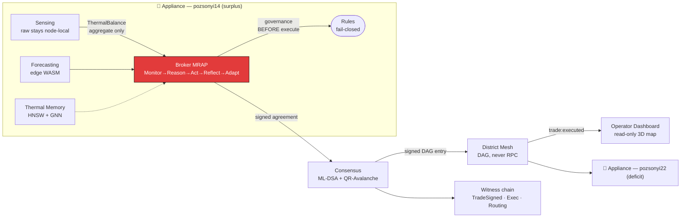

<div align="center">

# 🔥 Hőforrás

### Peer-to-Peer Thermal Energy Intelligence for District Heating

*Buildings that autonomously trade surplus heat to neighbours in deficit — safely, post-quantum-securely, and with a complete, verifiable audit trail. No human in the loop.*

<br/>

[](https://github.com/nicholas-ruest/hoforras/actions/workflows/ci.yml)
[](LICENSE)
[](https://www.rust-lang.org)
[](#testing-discipline)
[](#highlights)
[](#architecture)

</div>

---

## What is Hőforrás?

**Hőforrás** ("heat source" in Hungarian) is an autonomous, peer-to-peer thermal-energy market for
district heating networks. Each building runs a **Cognitum Appliance** that senses its own thermal
balance, forecasts demand on-device, and — when it has surplus heat — autonomously negotiates,
governs, signs, and routes a trade to a neighbour in deficit. Every privileged action is recorded in
a tamper-evident witness chain, so an operator *observes* an autonomous system rather than approving
each trade.

The pilot target is **District XIII, Budapest** (the `pozsonyi*.thermal.budapest.dark` mesh).



---

## Highlights

- 🔒 **No raw data ever leaves a building.** Only an aggregated `ThermalBalance` and post-training
  `Gradient`s cross a partition boundary — enforced at **compile time** (there is no
  `From<ThermalFrame> for Gradient`), not just by a runtime check.
- 🛡️ **Governance fails closed.** Hard physical-safety limits (≤500 kWh/day, ≥15% reserve, ≤6 bar,
  ≤6h) are checked *before* any execution; if the rules engine is unavailable, the trade is denied
  and the rejection is witnessed.
- 🔑 **Post-quantum by design.** Trade agreements are signed with **ML-DSA-65** and transported with
  **ML-KEM-1024** (real `fips204` / `ml-kem`, not stubs) — durable commitments stay verifiable
  against future quantum adversaries.
- 🧾 **Forensically complete audit.** Every executed trade emits a 64-byte hash-chained witness
  record for `{TradeSigned, Exec, Routing}`; the chain is tamper-evident and replayable.
- ⚡ **Edge-only intelligence.** Forecasting (LSTM/N-BEATS) runs on-device — no GPU, no cloud, no
  remote-inference seam even exists.
- 🩹 **Self-healing mesh.** Propagation is via signed DAG entries (never RPC); a node can drop
  mid-trade and rejoin, replaying missed entries with zero committed-state loss.

---

## Architecture

Hőforrás is built **hexagonally** (ports & adapters) with a strict dependency rule: the pure
`hoforras-domain` and `hoforras-ports` crates depend on **no** vendor/Ruv crate — enforced by a CI
layering lint. Every design decision is captured as an ADR (`.plans/adr/`, 15 of them), and the whole
build follows **SPARC** (Specification → Pseudocode → Architecture → Refinement → Completion) with
**London-School TDD** (outside-in, mock-driven).

### Repository layout

| Crate / package | Context (DDD) | Role |
|-----------------|---------------|------|
| `crates/hoforras-domain` | Ubiquitous language | Pure value types, the `Gradient` type wall, canonical (`postcard`) bytes |
| `crates/hoforras-ports`  | Hexagon edges | ~30 port traits over domain types only (mockable) |
| `crates/hoforras-sensor` | Sensing & Ingestion | validate→score→sign→emit, Ed25519 witnessing |
| `crates/hoforras-node`   | Isolation · Forecasting · Memory · **Appliance** | RVM coherence, edge inference, HNSW memory, single-runtime assembly |
| `crates/hoforras-broker` | **Thermal Market (CORE)** | MRAP broker, governance, thermal credits, federated training |
| `crates/hoforras-mesh`   | Consensus · District Mesh · AI Orchestration | ML-DSA/QuDAG consensus, self-healing DAG mesh, MCP bridge |
| `hoforras-dashboard/`    | Operator Experience | Read-only TS/React/react-three-fiber 3D district dashboard |

The **Appliance** (`hoforras-node`) assembles every context behind **exactly one tokio runtime** per
building; latency-critical coherence runs synchronously *off* the async path.

---

## Quick start

> Requires a Rust toolchain (`1.85+`) and, for the dashboard, Node `20+`.

```bash
# Build and test the whole Rust workspace
cargo build --workspace
cargo test  --workspace

# Lint gates (must pass in CI)
cargo clippy --workspace --all-targets -- -D warnings
cargo fmt --check
bash scripts/layering-lint.sh        # domain/ports stay vendor-free (ADR-0002/0003)

# Benchmarks (per-context NFR measurements)
cargo bench -p hoforras-node    --bench inference_path     # NFR-1 inference
cargo bench -p hoforras-mesh    --bench consensus_finality # NFR-2 finality
cargo bench -p hoforras-broker  --bench tick_loop          # the MRAP hot loop

# Run one Appliance (boots the single tokio runtime, wires all contexts)
cargo run --bin hoforras-node
```

```bash
# Operator dashboard
cd hoforras-dashboard
npm install
npm test           # vitest component + conformance suite
npm run dev        # serve the 3D district dashboard
```

---

## The headline: AC-7, demonstrated

The acceptance milestone is **one fully autonomous peer-to-peer thermal trade, no human input, with
a complete verifiable audit trail.** It is exercised end-to-end through the *real* broker, the *real*
ML-DSA consensus gateway, and the *real* hash-chained witness:

```
GIVEN  pozsonyi14 in surplus, pozsonyi22 in deficit
WHEN   the broker MRAP loop runs with NO operator input
THEN   ✓ decide → Offer; counterparty Bid accepted autonomously
       ✓ governance checked BEFORE execute (fail-closed)
       ✓ agreement {40 kWh, 6 h, 2.3 credits/kWh, route [7,12,18]}
         ML-DSA-signed, finality < 1 s
       ✓ heat routed along [junction_7, junction_12, junction_18]
       ✓ witness chain holds {TradeSigned, Exec, Routing}; verify == true
       ✓ no raw frame crossed any boundary (AC-8)
```

Recorded evidence from the live test:

```
AC-7 witness trail: [TradeSigned, Exec, Routing]; finality budget 22ms
```

Run it yourself:

```bash
cargo test -p hoforras-node --test acceptance -- --nocapture
cargo test -p hoforras-node --test integration_ladder   # 6-rung real-wiring ladder
```

---

## NFR benchmarks

Measured on **reference adapters** in this repo (the production Ruv substrate slots in behind the
same ports). Numbers are reported **honestly** with the Phase-C / hardware caveat — a core project
ethos.

| NFR | Target | Measured (reference) |
|-----|--------|----------------------|
| NFR-1 inference | < 100 ms | ~4 µs (spawn→infer→dissolve) |
| NFR-2 finality | < 1 s | ~0.72 ms local crypto path |
| NFR-4 similarity search | sub-ms | ~0.15 ms (top-5 / 1000 pts) |
| NFR-5 no GPU / no cloud | pass/fail | **pass** (on-device, no remote seam) |
| NFR-9 self-heal | 100% state preserved | **pass** (churn property) |

---

## Testing discipline

London-School TDD throughout: each unit is driven outside-in against mocked ports, adapters are
contract-tested against real behaviour, and safety/security invariants are property-tested.

- **147 Rust tests** across **37 test binaries** + **11 dashboard tests** — all green.
- Headline invariants are property tests: governance-before-execute & fail-closed (FR-3.7),
  gradient-only egress (FR-3.8), no-raw-scope capability (FR-4.4), single-writer tick (ADR-0006),
  self-heal without state loss (NFR-9), and a `trybuild` compile-fail proving the `Gradient` wall.
- Full **FR → ADR → test → demo** traceability is in
  [`.plans/completion-traceability.md`](.plans/completion-traceability.md).

---

## Project status

All ten implementation slices (P0–P10) are complete; every ADR (0001–0015) is implemented and
verified. **Honestly carried forward** (not hidden):

- Cross-district **federation** (FR-8.3) ships as a disclosed stub — market-signals-only, no raw
  data — with full acceptance deferred to a post-pilot milestone.
- Physical valve/pump actuation certification is out of pilot scope; pipe routing is modeled.
- Vendor RVM nanosecond figures are reported as *measured*, not asserted to the vendor spec.
- The integration ladder uses in-process reference fabrics + `SimSensorAdapter` for the 30-day
  backfill; production swaps in real ESP32 SEED nodes and the live `.thermal.budapest.dark` mesh
  with **no change to the domain** (ADR-0001/0002).

---

## License

Licensed under **MIT OR Apache-2.0**. See [`LICENSE`](LICENSE).
